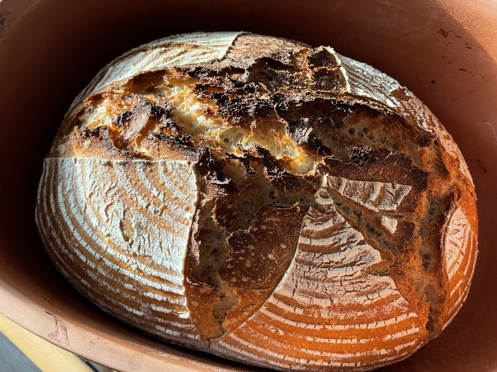
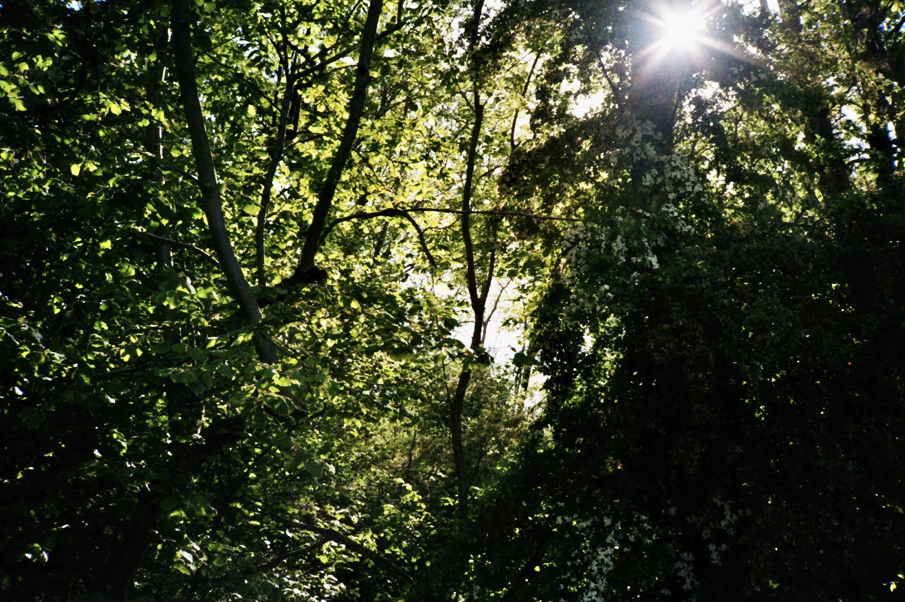
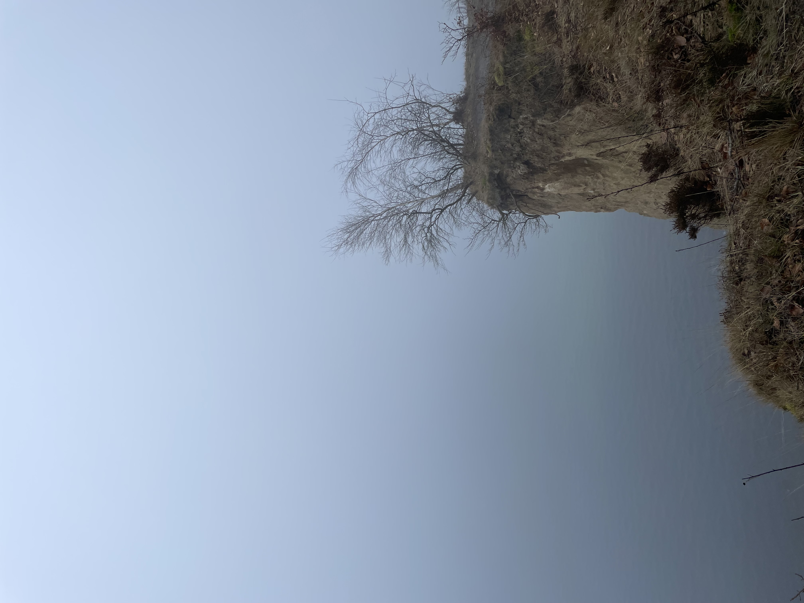
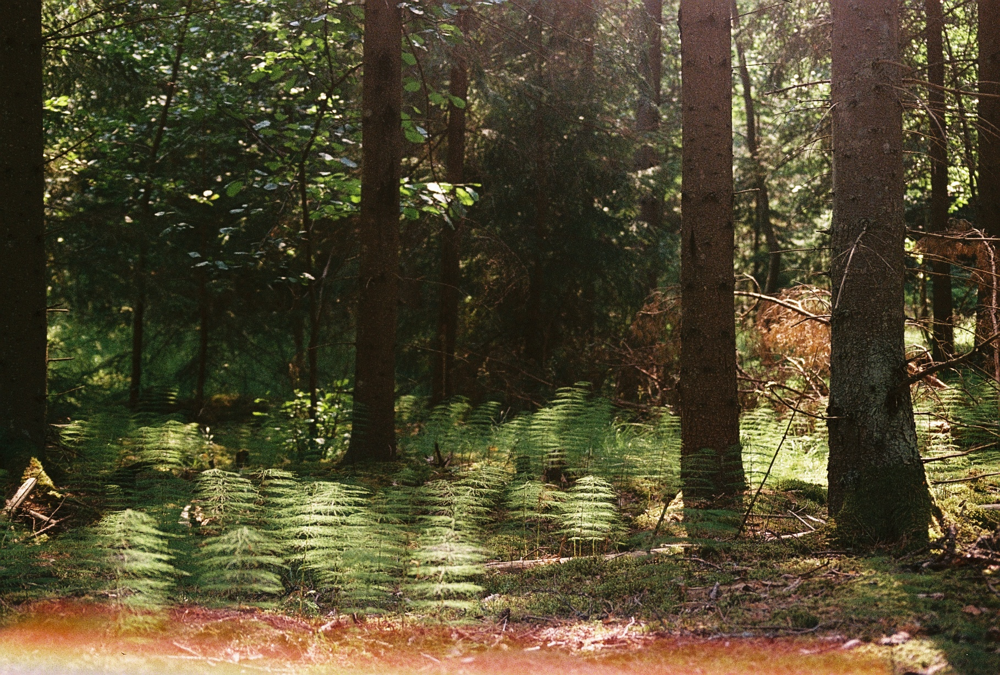
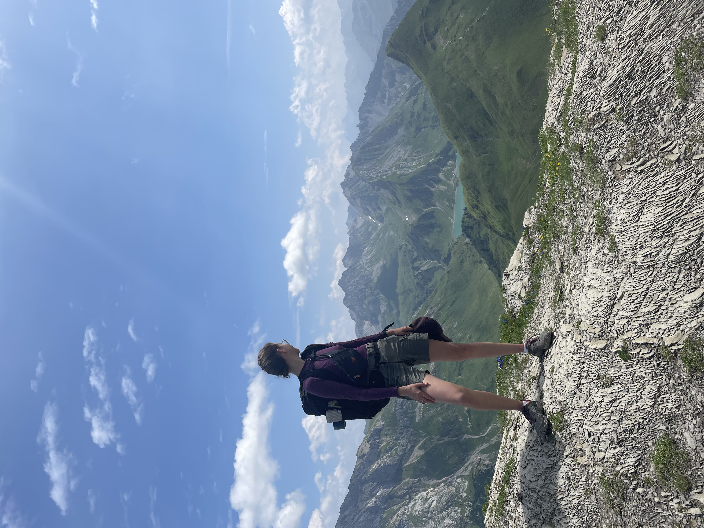
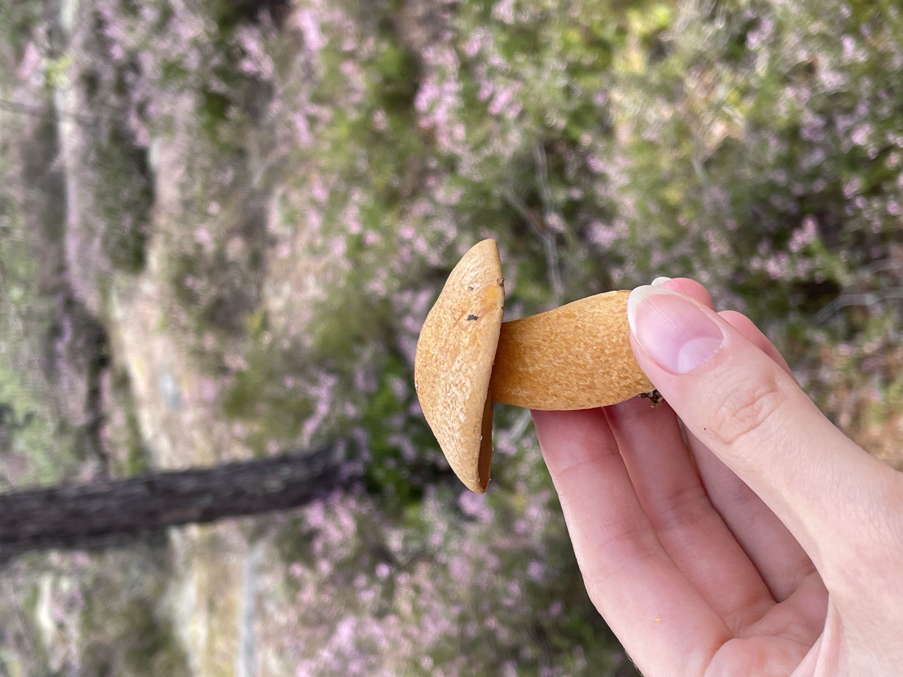
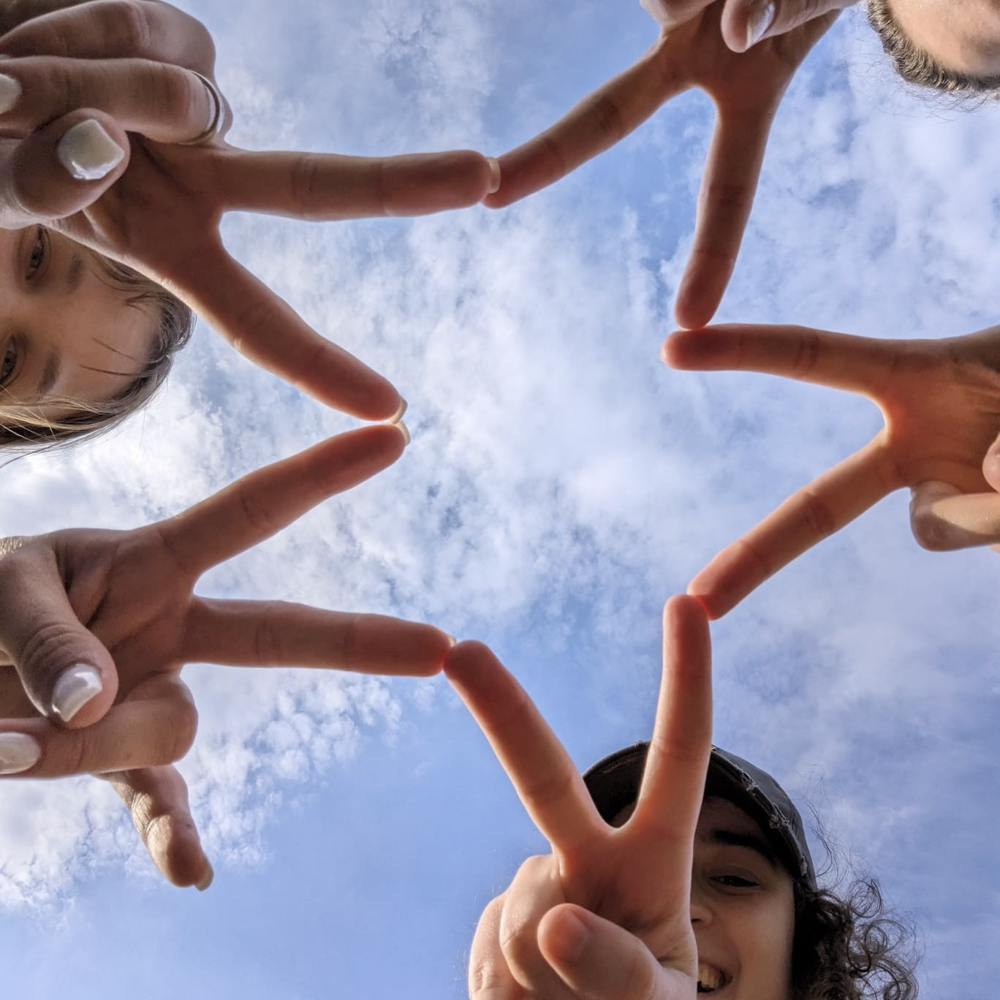
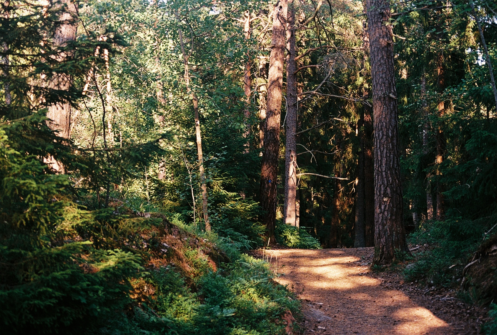
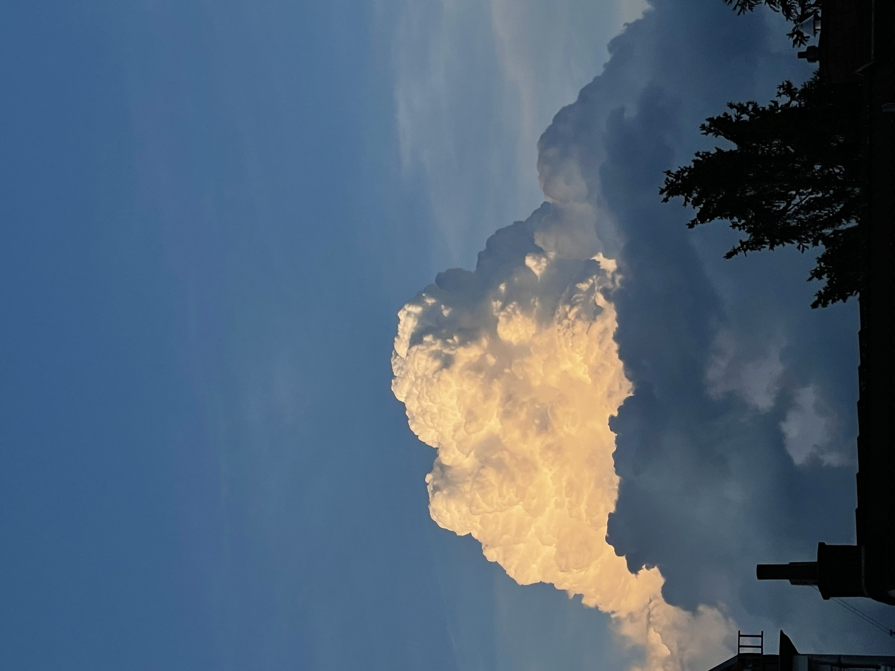

In my free time, you can find me making sourdough bread, taking pictures with my analogue camera, going on walks in the forest or the nearby botanical garden, touching moss (yes, that's one of my hobbies) or making creating little videos of vacations or me playing the piano. 
I also regularly go running to stay fit clear my mind.

Since 2017, I'm doing social media work for the non-profit [Help for a Smile e.V.](https://helpforasmile.de) and working with the board to further develop the organization!
It's a small organization that makes a real difference for 20 children and young adults in Uganda.

Here are some pictures that I took: 

  
  
  
  
  
  
  
  <!--  -->
  <!--  -->
  <!--  -->
  
  

