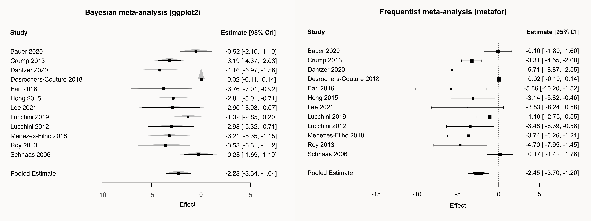

Recently, I worked on a project comparing frequentist and Bayesian meta-analytic frameworks. 
In the paper I wrote about this (submitted) I wanted to have a figure with both forest plots side-by side with the only visual difference being that the Bayesian forest plot contains posterior distributions.
While `metafor`'s `forest()` function does allow for some customization, adding posterior distributions is not possible.
This post shows how to recreate the look of the `metafor` forest plot entirely in `ggplot2`, using posterior draws from a `brms` random-effects meta-analysis.

{.lightbox}

## Let's begin!
First, we load packages and read in the two fitted models — a Bayesian model fitted with `brms` and a frequentist model fitted with `metafor`.
The frequentist model is used here only to extract the original study ordering, so the two plots are directly comparable.

```{r}
#| label: load_packages_data
#| warning: false
#| message: false

library(brms)
library(metafor)
library(tidyverse)
library(tidybayes)
library(ggridges)
library(glue)
library(here)
library(magick)

m.brm <- readRDS(here("posts", "meta-analysis", "forestplot", "data", "m.brm_full.rds"))
freq_model <- readRDS(here("posts", "meta-analysis", "forestplot", "data", "freq_full.rds"))
```

## Prepare data

Now we extract the posterior draws for each study-level effect using `spread_draws()` from `tidybayes`.
`r_author_year` contains the study-level deviations from the overall pooled effect (`b_Intercept`), so we add `b_Intercept` to get each study's absolute estimate on the outcome scale.
We then do the same for the pooled estimate alone and bind both together into a single long data frame.
The study labels are reordered to match the ordering in the frequentist model, with the pooled estimate placed at the bottom.

```{r}
#| label: data_wrangling

study.draws <- spread_draws(
  m.brm,
  r_author_year[author_year, ],
  b_Intercept
) %>%
  mutate(b_Intercept = r_author_year + b_Intercept)

pooled.effect.draws <- spread_draws(m.brm, b_Intercept) %>%
  mutate(author_year = "Pooled Estimate")

forest.data <- bind_rows(study.draws, pooled.effect.draws) %>%
  ungroup() %>%
  mutate(author_year = str_replace_all(author_year, "[.]", " ")) %>%
  mutate(
    author_year = factor(
      author_year,
      levels = c(rev(freq_model$data$author_year), "Pooled Estimate")
    )
  )

forest.data.summary <- group_by(forest.data, author_year) %>%
  mean_qi(b_Intercept)
```

To separate the pooled estimate visually from the individual studies, as `metafor`'s `forest()` does, we insert two blank spacer rows into the factor level ordering: one above and one below the individual studies.
These levels appear on the y-axis but carry no data, so nothing is drawn at those positions.
We also compute `n_levels_total`, which we need later to position the column headers and separator lines at the right y-coordinates.

```{r}
#| label: ordering_studies

n_studies <- nlevels(forest.data$author_year) # includes pooled estimate

study_levels <- setdiff(levels(forest.data$author_year), "Pooled Estimate")

new_levels <- c(
  "Pooled Estimate",
  "spacer_bottom",
  study_levels,
  "spacer_top"
)

forest.data <- forest.data %>%
  mutate(author_year = factor(author_year, levels = new_levels))

forest.data.summary <- forest.data.summary %>%
  mutate(author_year = factor(as.character(author_year), levels = new_levels))

# Append NA rows for the two spacer positions
spacer_rows <- tibble(
  author_year = factor(c("spacer_bottom", "spacer_top"), levels = new_levels),
  b_Intercept = NA_real_,
  .lower = NA_real_,
  .upper = NA_real_
)
forest.data.summary <- bind_rows(forest.data.summary, spacer_rows)

n_levels_total <- n_studies + 2
```

## Set linewidth & font size

We set a few shared size constants before building the plot.
`base_size_theme` controls text in `theme()` elements (in pts), while `base_size_geom` converts that to the different unit scale used by `geom_text()` and `annotate()`.

```{r}
#| label: set_sizes

linewidth <- 0.35
base_size_theme <- 12
base_size_geom <- base_size_theme * 0.352
title_size <- 14
```

## Building the ggplot

Now we build the plot layer by layer.
The dashed vertical line at x = 0 is drawn with `annotate("segment")` rather than `geom_vline()` because we need it to stop exactly at the top and bottom of the panel — `geom_vline()` would extend into the expanded margins.
`geom_density_ridges()` draws the posterior distribution for each study and for the pooled estimate, using `forest.data` which contains all draws.
`geom_pointinterval()` then overlays the mean and 95% credible interval on top, filtered to skip the spacer rows.
`geom_text()` places the numeric summary to the right of the panel at a fixed x position; `glue()` formats each label as `estimate [lower, upper]`.

The column headers ("Study" and "Estimate [95% CrI]") and the two horizontal separator lines are all placed with `annotate()`, using `n_levels_total` as the y reference so they sit just above the top study row.
`clip = "off"` in `coord_cartesian()` allows these annotations to extend beyond the panel boundary into the margin.
In `scale_y_discrete()`, the spacer labels are suppressed by replacing them with empty strings in the `labels` function, and `drop = FALSE` keeps them in the ordering even though they carry no plotted data.

```{r}
#| label: Bayes_forestplot

Bayes_forest_plot <- ggplot(
  aes(b_Intercept, author_year),
  data = forest.data
) +
  annotate(
    "segment",
    x = 0,
    xend = 0,
    y = 0,
    yend = n_levels_total,
    linewidth = linewidth,
    linetype = "dashed"
  ) +
  geom_density_ridges(
    fill = "grey",
    rel_min_height = 0.01,
    col = NA,
    scale = 1
  ) +
  geom_pointinterval(
    data = forest.data.summary %>% filter(!is.na(b_Intercept)),
    aes(xmin = .lower, xmax = .upper),
    shape = 22,
    point_fill = "black",
    fatten_point = 1.5,
    linewidth = 0.15
  ) +
  geom_text(
    data = mutate_if(
      forest.data.summary %>% filter(!is.na(b_Intercept)),
      is.numeric,
      round,
      2
    ),
    aes(
      label = glue(
        "{format(b_Intercept, nsmall = 2)} [{format(.lower, nsmall = 2)}, {format(.upper, nsmall = 2)}]"
      ),
      x = 3.5
    ),
    hjust = 0.2,
    size = base_size_geom
  ) +
  annotate(
    "text",
    x = -17.4,
    y = n_levels_total + 1,
    label = "Study",
    hjust = 1.05,
    fontface = "bold",
    size = base_size_geom
  ) +
  annotate(
    "text",
    x = 3.5,
    y = n_levels_total + 1,
    label = "Estimate [95% CrI]",
    hjust = 0.27,
    fontface = "bold",
    size = base_size_geom
  ) +
  annotate(
    "segment",
    x = -19.5,
    xend = 8,
    y = n_levels_total,
    yend = n_levels_total,
    linewidth = linewidth
  ) +
  annotate(
    "segment",
    x = -19.5,
    xend = 8,
    y = 2,
    yend = 2,
    linewidth = linewidth
  ) +
  labs(
    title = "Bayesian meta-analysis (ggplot2)",
    x = "Effect",
    y = NULL
  ) +
  scale_y_discrete(
    expand = expansion(add = c(0.5, 2.4)),
    labels = function(x) ifelse(x %in% c("spacer_bottom", "spacer_top"), "", x),
    drop = FALSE
  ) +
  scale_x_continuous(
    breaks = seq(-15, 5, by = 5),
    expand = expansion(add = c(2, 4))
  ) +
  coord_cartesian(
    xlim = c(-9.7, 5),
    clip = "off"
  ) +
  guides(x = guide_axis(cap = "both")) +
  theme_minimal() +
  theme(
    panel.border = element_blank(),
    panel.grid.major = element_blank(),
    panel.grid.minor = element_blank(),
    panel.background = element_blank(),
    plot.margin = margin(t = 18.5, r = 10, b = 35, l = 20),
    plot.title = element_text(hjust = 0, face = "bold", size = title_size),
    plot.background = element_rect(fill = "transparent", colour = NA),
    axis.text.y = element_text(
      hjust = 0,
      margin = margin(r = -10),
      size = base_size_theme,
      colour = "black"
    ),
    axis.text.x = element_text(vjust = -1, size = base_size_theme),
    axis.title.x = element_text(vjust = -2.7, size = base_size_theme),
    axis.line.x = element_line(linewidth = linewidth),
    axis.ticks.x = element_line(linewidth = linewidth),
    axis.ticks.length.x = unit(0.3, "cm"),
  )
```

# Results

Okay, let's now have a look and compare what we've built to the `metafor` forest plot! 

```{r}
#| label: compare
#| include: false

ggsave(
  "data/Bayes_forest_plot.png",
  Bayes_forest_plot,
  width = 20,
  height = 15,
  units = "cm",
  bg = "transparent"
)

png(
  "data/freq_forestplot.png",
  width = 20,
  height = 15,
  units = "cm",
  res = 300,
  bg = "transparent"
)

forest(
  freq_model,
  slab = str_replace_all(freq_model$data$author_year, "[.]", " "),
  mlab = "Pooled Estimate",
  xlab = "Effect",
  main = "Frequentist meta-analysis (metafor)"
)

dev.off()

img1 <- image_read("data/Bayes_forest_plot.png")
img2 <- image_read("data/freq_forestplot.png")
combined <- image_append(c(img1, img2), stack = FALSE)
image_write(combined, "data/forest_plots_combined.png")
```

{.lightbox}